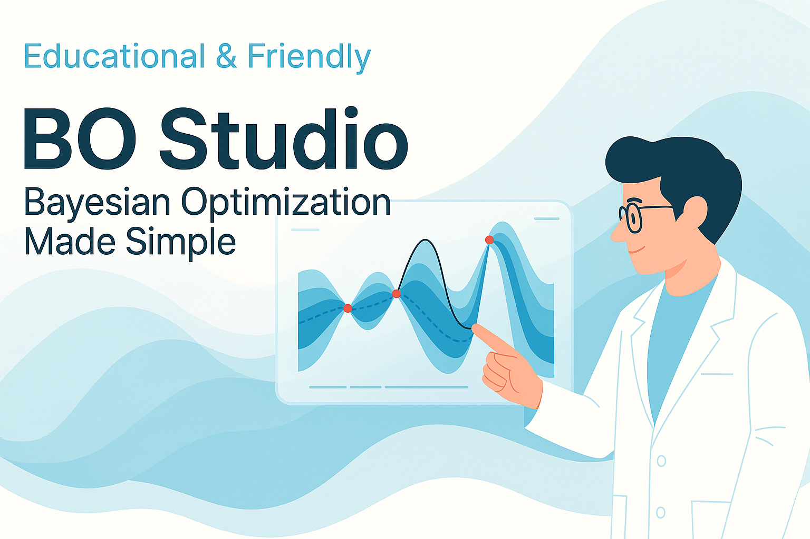
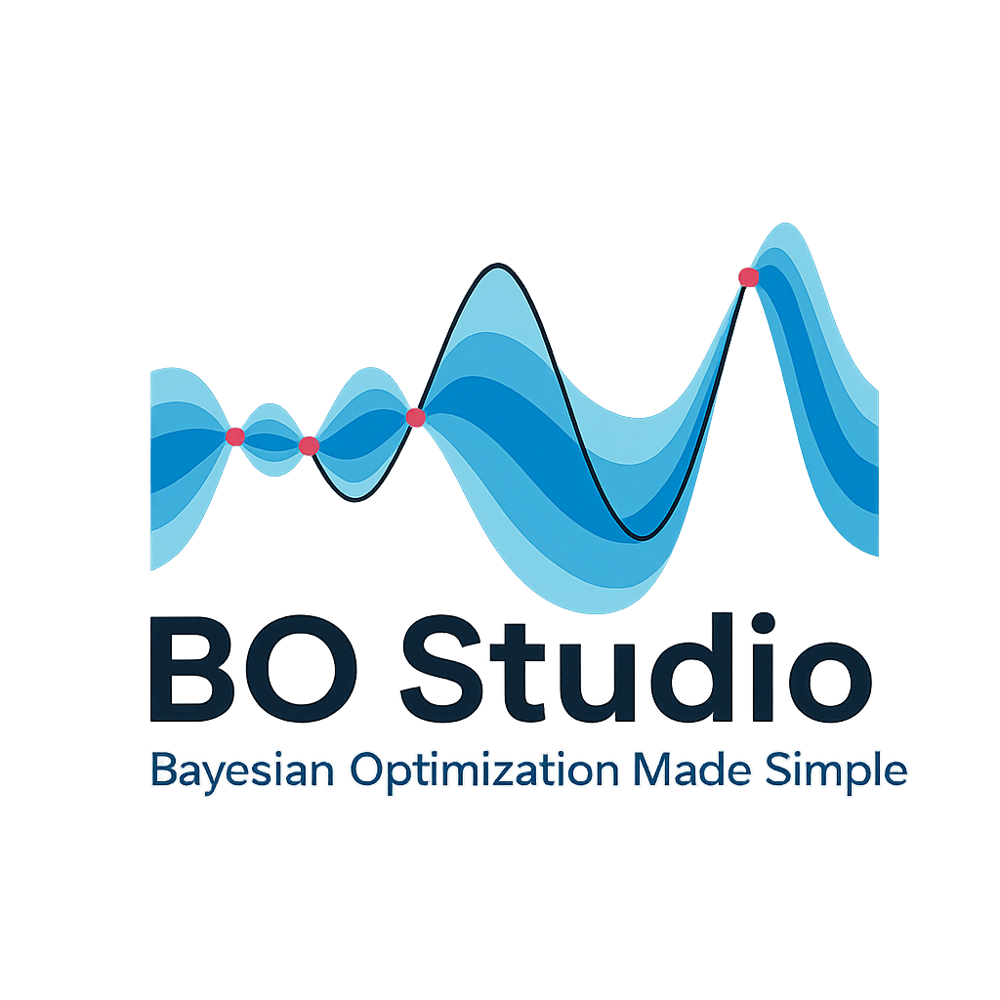

# 🧪 BO Studio – Bayesian Optimization Made Simple V1


---
# Why BO Studio?

**BO Studio** is a user-friendly and modular Streamlit web app designed for manual experimentation with Bayesian Optimization.  
Whether you're learning, simulating, or running real-world experiments, BO Studio provides an intuitive interface for designing, tracking, and analyzing your optimization campaigns — no automation required.

Ideal for:

Students and researchers learning Bayesian Optimization

Manual experimental campaigns

Interactive exploration and simulation

---

## 🌐 Try It Online

🟢 **BO Studio is available as a web app** – no installation needed!  
👉 [Launch BO Studio in your browser](https://bo-studio.onrender.com/)

---

## 🚀 Features

- 🧰 Manual Bayesian Optimization campaigns (with simulated or real data)
- 📊 Live visualization of optimization progress
- 💾 Save, resume, and preview optimization runs
- 📚 Built-in **Bayesian Optimization Classroom** to learn BO concepts
- 🗂️ Structured **experiment database** with user-linked access
- ❓ Integrated **FAQ and help section**

---

## 🖼️ Preview



---

## 🛠️ Getting Started (Local Installation)

> You can run BO Studio locally if you prefer.

### 📦 Installation

1. Clone the repository:
   ```bash
   git clone https://github.com/YOUR_USERNAME/bo-studio.git
   cd bo-studio
