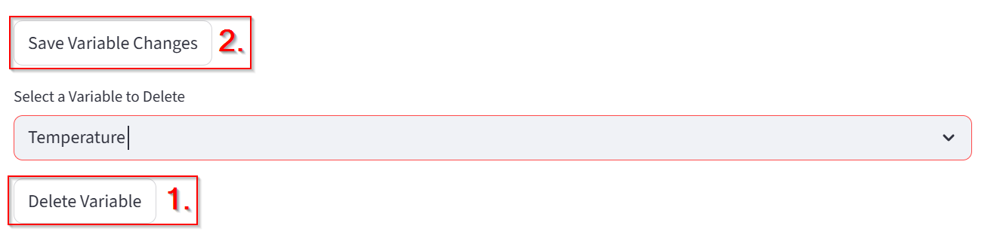
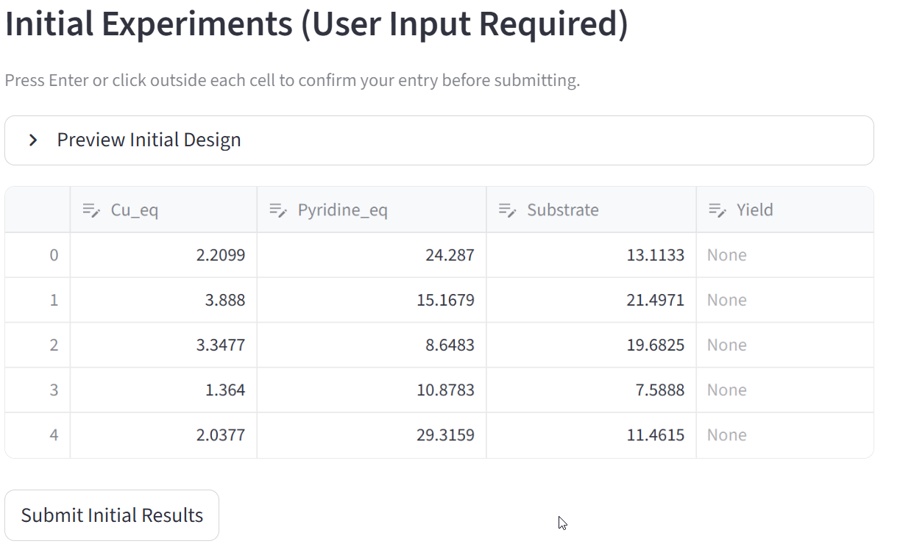

# Single Objective Optimization Campaign — Case Study Tutorial

This page allows you to define and run a **Single Objective Optimization (SOO)** experiment.  
A single objective optimization problem focuses on finding the **best possible value** (minimum or maximum) of one target function by adjusting one or more input variables within defined limits.
When you want to optimaze multiobjective problem see the page **Multi Objective Optimization**.

This tutorial walks you through a complete single objective optimization campaign step by step.  
You will learn how to define variables, set up the optimization, enter experimental results, and interpret the outcome.

---

## What Is a Single Objective Optimization?

In a **Single Objective Optimization**, you are trying to **optimize one measurable outcome** (the “objective”) by changing the values of one or more **variables**.

Mathematically:

> Find x ∈ X such that  
> f(x) is minimized (or maximized)

where:
- **x** – vector of input variables  
- **X** – allowed range for each variable  
- **f(x)** – objective function (what you want to optimize)

---

## Goal of the Case Study

We will perform a **reaction yield optimization** — our goal is to **maximize the reaction yield (%)**. For this case study example reaction of TO DO is used.

---

## 1. Define the Campaign

1. Enter a descriptive **Experiment Name** — e.g.  
   `Optimization tutorial`.
2. Optionally, add **Notes**.
3. The **Experiment Date** field fills automatically — you can edit it if needed.

Press **Save Campaign** to store the configuration.

---

## 2. Define and Edit Variables

Next, define the experimental variables that the optimizer can change.

For each variable:
- **Variable Type:** Choose `Continuous` (numeric range) or `Categorical` (discrete options).
    - Continuous: The variable can take any numerical value within a range (e.g., temperature = 20–100 °C).
    - Categorical: The variable can take only specific, named options (e.g., material type = {Aluminum, Steel, Copper}, solvents = {MeOH, THF, DMSO}).
- **Variable Name:** For example, `Temperature`.
- **Lower/Upper Bound:** Define the allowed range (e.g., 30–120 °C).
- **Unit (optional):** Add units like `°C`, `bar`, or `min`.

Click **Add Variable** to include it in your setup.

---

### Edit Variables

If you make changes later, update them directly in the table and click **Save Variable Changes**.

### Delete Variables

Select a desired variable to be deleted from the dropdown menu, click **Delete Variable**, and then confirm with **Save Variable Changes**.

---

## 3. Experiment Setup

**Field:** `Response to Optimize`

- Choose the **objective function** — the quantity you want to minimize or maximize.
- This is typically a measured or calculated field (e.g., “Yield”, “Error”, “Efficiency”, “Voltage Drop”).

> Example: If your goal is to **maximize yield**, select `Yield` as the response.

**Field:** `Initial Experiments`

- Number of experiments to generate before optimization starts.
- These experiments give the optimizer initial data to learn from.
- Typical range: `3–10`

**Field:** `Total Iterations`

- Total number of optimization cycles to perform.
- Each iteration tests a new set of variable values based on previous results.

> Example: If Total Iterations = 20, the optimizer will run 20 rounds of testing to find the best solution.

**Field:** `Initialization Method`

Defines how the **initial experimental points** are chosen before optimization begins.

Options:
- **Random:** Initial points are generated randomly within variable ranges.
- **LHS:** 
- **Halton:** 
- **Maximin LHS:** 

**Field:** `Acquisition Function`

Controls how new experimental points are chosen during optimization.  
Common methods:
- **EI (Expected Improvement):** Chooses points that are most likely to improve the best result so far.  
- **PI (Probability of Improvement):** Focuses on points that have a high chance of being better than the current best.  
- **LCB (Lower Confidence Bound):** Balances exploration (trying new areas) and exploitation (improving known good areas).

> Choose EI if you’re unsure — it’s the most commonly used and balances exploration and exploitation.

---

## 4. Generate Initial Experiments

Click **Suggest Initial Experiments**.  
The system generates a design table based on your variable ranges and initialization method.

Fill in your **measured results** (e.g., Yield) for each row.  
Press **Submit Initial Results** when done.

---

## 5. Run the Optimization Loop

Once initial data is submitted, the optimizer proposes the **Next Experiment Suggestion** — the next best parameter combination to test.

1. Perform the experiment with the suggested parameters.  
2. Enter the measured value (e.g., `Yield = 41.08`) in the **Result for Yield** field.  
3. Press **Submit Result**.

The system automatically updates the model and suggests the next point.

Repeat until all iterations are completed.

---

## 6. Monitor Optimization Progress

During or after the optimization, you can visualize how the process evolves.

### Parallel Coordinates Plot

Shows all tested experiments and how each variable affects the yield.

- Each line = one experiment  
- Color = Yield value  
- Patterns indicate which variables most influence the result.

---

### Optimization Progress Chart

Displays selected variable progress versus experiment number.

This chart helps you track whether the optimization is converging toward higher yields.

---

## 7. Optimization Completed

When all iterations are done, you’ll see a summary table with all tested conditions.

### Exporting Data

- **Download Results as CSV** – Save all data locally.  
- **Save to Database** – Store results for future campaigns.

---

## 8. Resume or Reuse Campaigns

You can reuse or continue previous campaigns.

- **Resume from Previous Manual Campaign:** Continue an interrupted run.  
- **Reuse Previous Campaign as Seeds:** Start a new campaign using previous results as training data.

---

## 9. Edit and Reuse Previous Experiments

If you want to adjust or reselect previous results:

1. Check or uncheck experiments you want to include.  
2. Click **Use Selected Experiments**.  
3. Optionally, enable “Skip additional random initial points” to start optimization immediately from the existing dataset.

---

## 10. Results and Best Conditions

Once finished, the optimizer reports the **best-performing conditions** based on your objective (e.g., maximum yield).

You can:
- Review all results in the table
- Export as CSV
- Save to the database for later use or reporting
- Add new suggestions if you are not satisfied

---

## Summary of the Case Study

| Step | Description | Key Action |
|------|--------------|------------|
| 1 | Define campaign | Set experiment name and notes |
| 2 | Add variables | Define parameter ranges |
| 3 | Configure setup | Select response, iterations, and acquisition |
| 4 | Generate initial experiments | Create starting dataset |
| 5 | Enter data | Input measured yield |
| 6 | Get next suggestion | Run next experiment |
| 7 | Monitor progress | Check charts and convergence |
| 8 | Save results | Export CSV or database |
| 9 | Reuse or modify campaign | Resume or retrain optimizer |