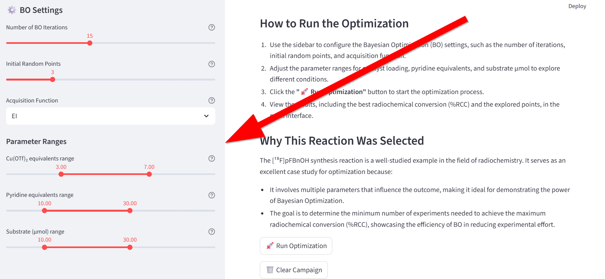

# Simulation Case 1

# Bayesian Optimization Playground Manual
### Optimize the [¹⁸F]pFBnOH Synthesis Experiment

This simulation lets you explore how **Bayesian Optimization (BO)** can be used to improve a chemical reaction — in this case, the copper-mediated radiofluorination to produce **[¹⁸F]pFBnOH**.  
You can freely experiment with the settings to see how BO explores parameter space and improves yield (radio-chemical conversion, %RCC).

---

## Goal

Your objective is to **maximize %RCC**, the radiochemical conversion, by adjusting:
- Catalyst loading (**Cu(OTf)₂ equivalents**)
- Pyridine (**ligand equivalents**)
- Precursor (**substrate µmol**)

Bayesian Optimization will intelligently suggest new experiments based on previous results to find the best reaction conditions efficiently.

---

## Interface Overview

### **Left Panel – BO Settings**
These control how the optimization behaves.

| Setting | Description | How to Experiment |
|----------|--------------|-------------------|
| **Number of BO Iterations** | Total number of optimization steps (including initial random points). More steps = more exploration. | Try small values (5–10) for quick demos, or 20–30 for deeper exploration. |
| **Initial Random Points** | Number of random experiments before BO starts learning patterns. This helps BO explore the space. | Fewer random points make BO start learning earlier, but it might miss some regions. Try 2–5 to see the tradeoff. |
| **Acquisition Function** | Strategy BO uses to decide the next experiment. Common choices: <ul><li>**EI (Expected Improvement)** – balances exploration & exploitation.</li><li>**UCB (Upper Confidence Bound)** – explores uncertain regions more.</li><li>**PI (Probability of Improvement)** – focuses on small improvements.</li></ul> | Try switching functions to see how the exploration pattern changes. EI is usually a good default. |

---

### **Parameter Ranges**
These sliders define the experimental search space.  
Think of them as the adjustable knobs on your virtual reactor.

| Parameter | Meaning | Effect |
|------------|----------|--------|
| **Cu(OTf)₂ equivalents range** | Catalyst loading. Higher values increase reaction rate but may reduce selectivity or waste catalyst. Range of catalyst loading (Cu). Typical: 1–4 eq. | Try narrowing or expanding this range (e.g., 1.0–2.5 vs. 1.0–4.0) to see how BO focuses. |
| **Pyridine equivalents range** | Ligand amount. Pyridine stabilizes copper complexes — too little and the catalyst is unstable, too much and the reaction can slow down. Typical: 5–30 eq.| Experiment with a wide range (5–30) to see how the model learns an optimal window. |
| **Substrate (µmol) range** | Amount of precursor. This affects both conversion and yield. Typical: 5–25 µmol. | Try changing limits (e.g., 5–25 µmol vs. 10–40 µmol) to see how the optimizer handles scale. |

---

## How to Run the Optimization

1. **Set up your parameters**  
   Use the sliders to adjust parameter ranges and BO settings.  
2. **Choose acquisition function**  
   From the dropdown, pick your strategy (EI, PI, or UCB).  
3. **Click “Run Optimization”**  
   The system will simulate the reaction multiple times.  
   You’ll see points explored and the best %RCC found.  
4. **Check Results**  
   The app displays the best conditions found and how exploration evolved.  
5. **Reset with “Clear Campaign”**  
   Starts a new optimization session — great for testing new ideas.  

---

## Tips for Exploration

- Play with **different acquisition functions** to see how each explores the parameter space.  
- Reduce or expand parameter ranges to see how it affects the final optimum.  
- Imagine you are the experimental chemist:  
  - Cu(OTf)₂ = catalyst strength  
  - Pyridine = ligand stabilizer  
  - Substrate = how much reactant you give the system  

---

## What You’ll Learn

- How **Bayesian Optimization** balances exploration and exploitation.  
- How reaction parameters interact in chemical optimization.  
- How adjusting parameter ranges affects search efficiency.  
- That “optimal” depends not only on chemistry — but also on **how you guide the algorithm**.

---

