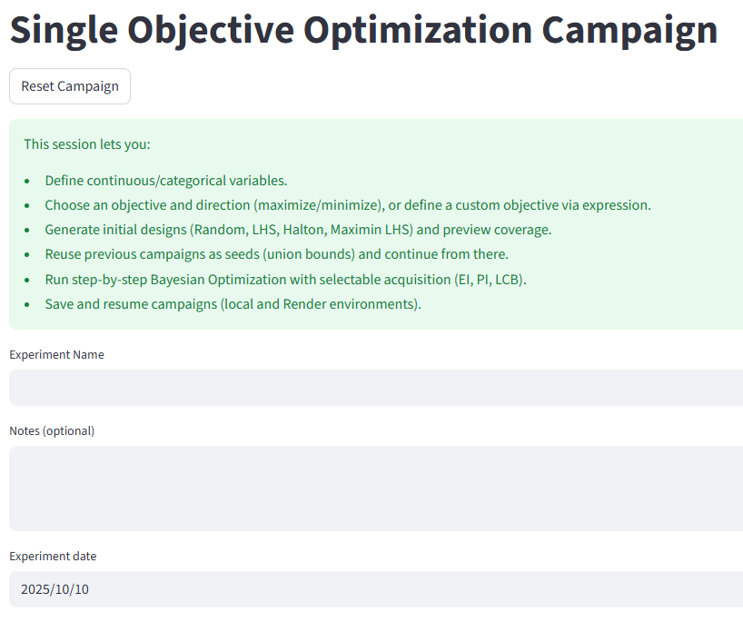
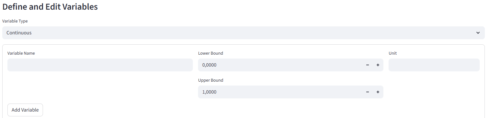
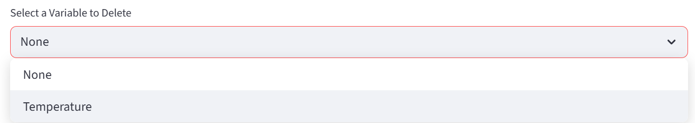
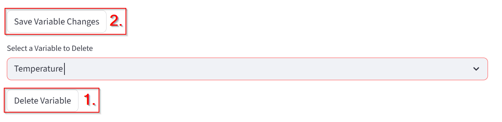
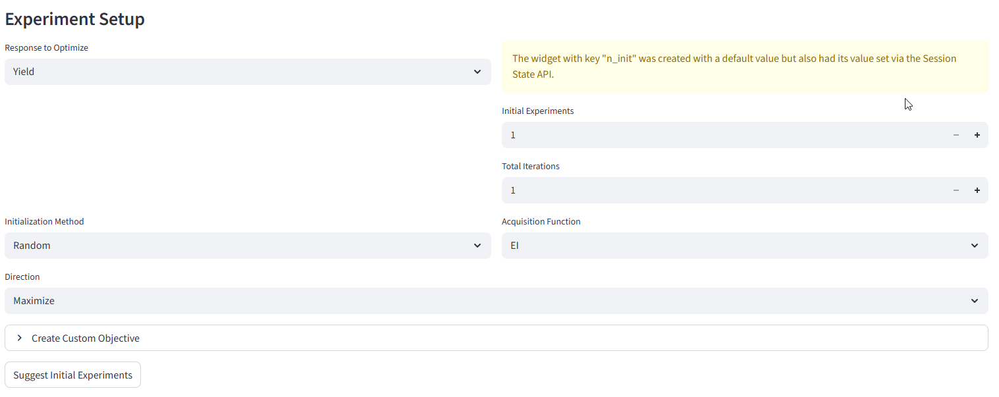

# Single Objective Optimization Campaign — User Guide

This page allows you to define and run a **Single Objective Optimization (SOO)** experiment.  
A single objective optimization problem focuses on finding the **best possible value** (minimum or maximum) of one target function by adjusting one or more input variables within defined limits.
When you want to optimaze multiobjective problem see the page **Multi Objective Optimization**.

---

## What Is a Single Objective Optimization?

In a **Single Objective Optimization**, you are trying to **optimize one measurable outcome** (the “objective”) by changing the values of one or more **variables**.

Mathematically:

> Find x ∈ X such that  
> f(x) is minimized (or maximized)

where:
- **x** – vector of input variables  
- **X** – allowed range for each variable  
- **f(x)** – objective function (what you want to optimize)

---

## Step-by-Step Guide

### 1. Define campaign

**Field:** `Experiment Name`

- Enter a descriptive name for your experiment (e.g. `Optimization of Reaction Yield in Ethyl Acetate Synthesis`).
- This helps you identify your campaign later when saving or resuming.

**Field:** `Notes`

- Use this field to write any comments, goals, or context for the experiment.

**Field:** `Experiment Date`

- Automatically filled with the current date. You can change the date by clicking inside the field.

---

## Define and Edit Variables

This is where you define the **input parameters** that the optimizer can change.

**Option:** `Continuous` or `Categorical`

- **Continuous:** The variable can take any numerical value within a range (e.g., temperature = 20–100 °C).
- **Categorical:** The variable can take only specific, named options (e.g., material type = {Aluminum, Steel, Copper}, solvents = {MeOH, THF, DMSO}).

**Field:** `Variable Name`

- Type the name of your variable (e.g., `Temperature`, `Pressure`).

**Fields:** `Lower Bound`, `Upper Bound`

- Define the minimum and maximum allowed values for the variable.
- These set the **search space** for the optimization.
- Example:
  - Lower Bound = `0`
  - Upper Bound = `100`

**Field:** `Unit`

- (Optional) Specify the physical unit of the variable.
- Example: `°C`, `M`, `V`, `s`

**Button:** `Add Variable`

- Click to add the defined variable to your optimization setup.
- You can add multiple variables (e.g., Temperature, Voltage, Pressure).

### Edit variables
- If you want to change the variable later you can do it in the table below. DO NOT FORGET TO PRESS "Save Variable Changes"!

---

### Delete Variable
Select variable you want to delete from the menu and press **Delete Variable**.

To apply changes you also have to press **Save Variable Changes**.

---

## Experiment Setup

This section defines **how** the optimization will run.

**Field:** `Response to Optimize`

- Choose the **objective function** — the quantity you want to minimize or maximize.
- This is typically a measured or calculated field (e.g., “Yield”, “Error”, “Efficiency”, “Voltage Drop”).

> Example: If your goal is to **maximize yield**, select `Yield` as the response.

**Field:** `Initial Experiments`

- Number of experiments to generate before optimization starts.
- These experiments give the optimizer initial data to learn from.
- Typical range: `3–10`

**Field:** `Total Iterations`

- Total number of optimization cycles to perform.
- Each iteration tests a new set of variable values based on previous results.

> Example: If Total Iterations = 20, the optimizer will run 20 rounds of testing to find the best solution.

**Field:** `Initialization Method`

Defines how the **initial experimental points** are chosen before optimization begins.

Options:
- **Random:** Initial points are generated randomly within variable ranges.
- **LHS:** 
- **Halton:** 
- **Maximin LHS:** 

**Field:** `Acquisition Function`

Controls how new experimental points are chosen during optimization.  
Common methods:
- **EI (Expected Improvement):** Chooses points that are most likely to improve the best result so far.  
- **PI (Probability of Improvement):** Focuses on points that have a high chance of being better than the current best.  
- **LCB (Lower Confidence Bound):** Balances exploration (trying new areas) and exploitation (improving known good areas).

> Choose EI if you’re unsure — it’s the most commonly used and balances exploration and exploitation.

---

## Generate Experiments

**Suggest Initial Experiments**

- Automatically generates initial experimental points based on:
  - Variable ranges
  - Initialization method
  - Number of initial experiments

These points can then be used to start the optimization campaign.

---

## Optimization Process Summary

1. Define all variables and their limits.  
2. Choose the response to optimize (objective function).  
3. Select initialization method and acquisition function.  
4. Generate initial experiments.  
5. Run optimization — the system tests combinations of variables to find the best result.

---

## Example Setup

TO DO: screenshot

Goal: **Maximize reaction yield** by adjusting temperature and pressure.

---

## Tips

- Always define realistic bounds to prevent invalid experiments.  
- Start with a small number of variables to understand the workflow.  
- If unsure, use:
  - Initialization Method: **Random**
  - Acquisition Function: **EI (Expected Improvement)**  
- Record notes about each campaign for traceability.

---

## Troubleshooting

TO DO: Possible problems?
---

## Output

After running, the optimizer provides:
- A set of variable combinations tested.  
- Corresponding objective values (measured or predicted).  
- The **best-performing configuration** based on your chosen objective.

---

## Glossary of Key Terms

| Term | Meaning |
|------|----------|
| **Variable** | An input parameter that can be adjusted (e.g., temperature, speed). |
| **Objective Function** | The quantity you want to optimize (e.g., maximize yield, minimize error). |
| **Bounds** | Limits for variable values (minimum and maximum). |
| **Initialization** | The first set of experiments before optimization begins. |
| **Iteration** | One cycle of testing and updating the optimization model. |
| **Acquisition Function** | Mathematical rule to decide which point to test next. |
| **Response** | Measured or calculated output value that represents the objective. |